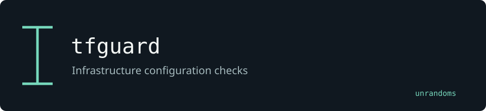

# tfguard

Tests infrastructure plans against behavior-driven rules. Additions cover reusable configuration checks, Helm-to-plan conversion and GitHub Actions annotations.

Maintained by [unrandoms](https://github.com/unrandoms), derived from [terraform-compliance/cli](https://github.com/terraform-compliance/cli).

## Fork-specific work

- [`terraform_compliance/steps/cis/cis_steps.py`](terraform_compliance/steps/cis/cis_steps.py)
- [`terraform_compliance/common/helm_plan.py`](terraform_compliance/common/helm_plan.py)
- [`terraform_compliance/extensions/github_actions_formatter.py`](terraform_compliance/extensions/github_actions_formatter.py)

## Validation and limits

The included checks cover selected controls; they do not constitute a complete CIS benchmark or a compliance certification. Helm conversion is an adapter, not a real Terraform plan.

This documentation update does not certify all inherited features. The [archived reference](UPSTREAM_README.md) describes the original ecosystem; its package names and release links may target upstream rather than this fork.

## Credits

See [CREDITS.md](CREDITS.md) for the distinction between the original implementation and this fork's adaptations. Original licenses and copyright notices remain in the repository.
